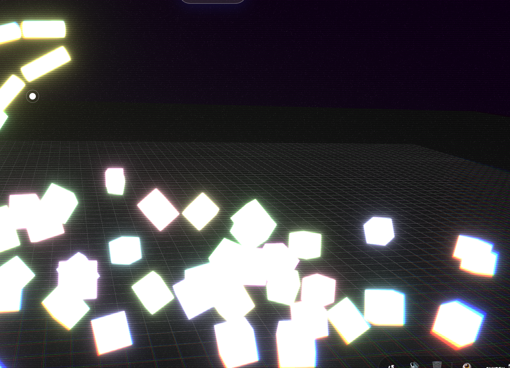
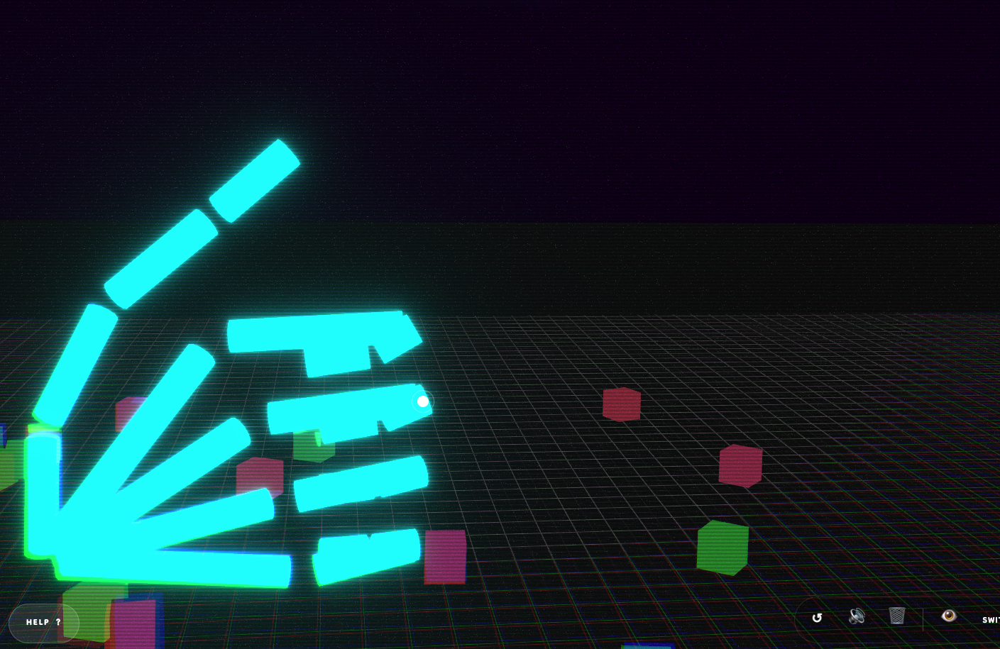
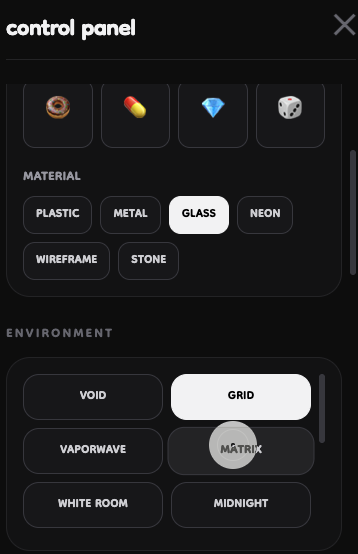
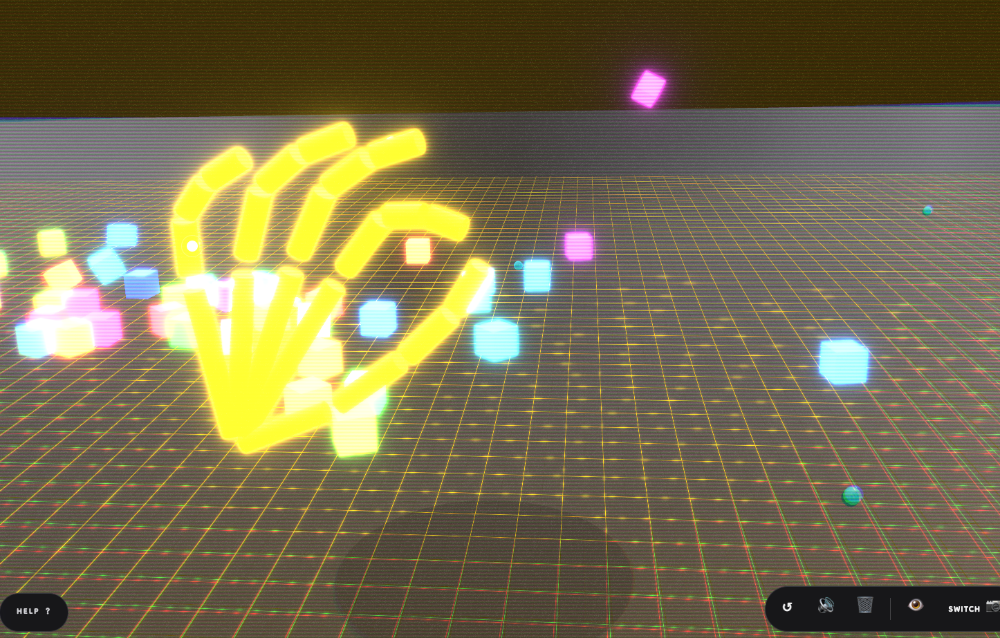

# ✋ rigomator
### your body is the controller.

 

  <i>real-time hand & head tracking in the browser.</i>

 

---

## 🌌 what is rigomator?

**rigomator** is an interactive web experience that turns your  
hand and head movement into a digital playground.

it uses your webcam to track motion in real time and transform it into:
- fluid interaction ✨  
- expressive gesture control 🖐  
- immersive presence 🌐  
- intentional weirdness 😏  

no setup.  
no installs.  
no friction.

just open the site and start moving.

---

## 🧠 what does it track?

rigomator reads your motion like input.

- 🖐 hands — gestures, fingers, movement  
- 🧍 head — tilt, rotation, and lean  
- 🎯 presence — the system reacts as *you* move

you’re no longer clicking interfaces…  
you’ve **become** the interface.

---

## 🎮 what happens inside?

rigomator is not a tool.  
it’s a playground.

inside, you’ll find:
- reactive environments  
- floating objects and physics  
- gesture-driven interaction  
- playful systems to experiment with  

it’s half experiment  
half sandbox  
all energy.

---

## 🌐 experience it live

visit:

👉 https://farlaxfard.github.io/Rigomator/

camera permission required.  
swagger optional.

---

## 🖼 gallery

replace these with your own screenshots:

---

## ✨ why rigomator exists

because clicking is boring.  
because movement feels better.  
because screens deserve emotion.

rigomator is built for:
- exploration  
- curiosity  
- expression  
- creation  

and maybe a little flexing.

---

## 🧑‍💻 created by

**farlaxfard**  
developer • designer • menace

---

## 🖤 final note

this isn’t software.

this is a space where your body becomes code  
and your screen becomes a mirror.

now go wave at your camera and enjoy it.